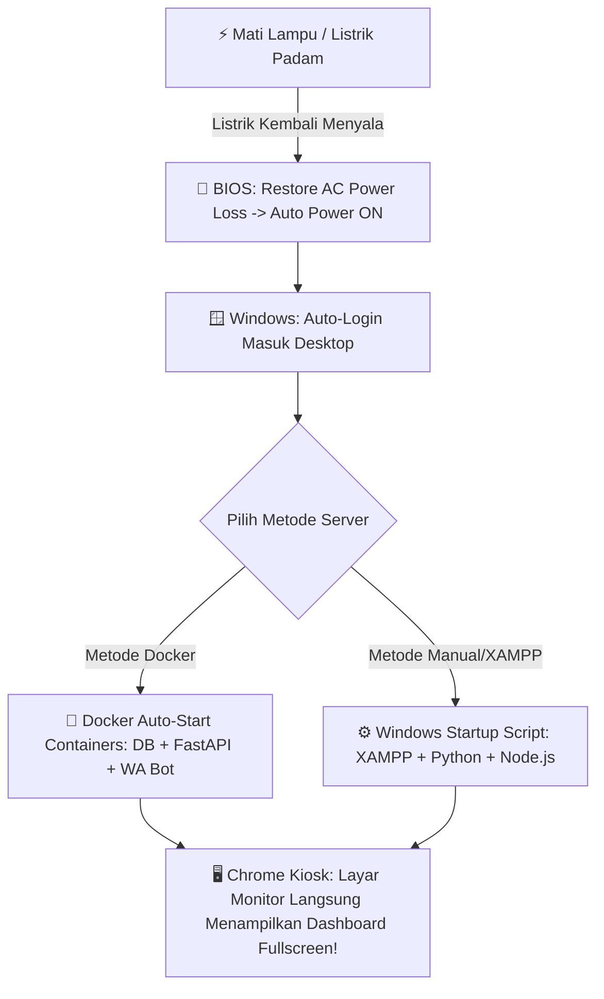

# 🖥️ Panduan Lengkap: Auto-Start Server Lab UNAMA (24/7 Standby)

Dokumen ini berisi panduan konfigurasi agar PC Server / Monitor Display Lab UNAMA dapat **hidup dan berjalan secara otomatis 100% tanpa perlu disentuh manusia**, bahkan setelah terjadi mati lampu atau pemadaman listrik.

---

## 📋 Ringkasan Alur Otomatisasi


---

## 🔌 TAHAP 1: Konfigurasi BIOS (Auto Power-On Saat Listrik Nyala)
Secara *default*, PC akan tetap mati saat listrik menyala kembali. Kita perlu mengaktifkan fitur hardware BIOS agar PC langsung menyala otomatis.

### Langkah-langkah:
1. Nyalakan PC Lab, lalu tekan tombol **`F2`** atau **`Delete`** berulang kali hingga masuk ke menu **BIOS / UEFI**.
2. Masuk ke menu **Power Management** / **Advanced Power Settings** / **APM Configuration**.
3. Cari pengaturan bernama salah satu dari berikut (tergantung merk motherboard: Asus/Gigabyte/MSI/Asrock/Dell/HP):
   - **`Restore on AC Power Loss`**
   - **`AC Back`** / **`AC Power Recovery`**
   - **`State After G3`**
   - **`After Power Failure`**
4. Ubah nilainya dari *Power Off* menjadi **`Power On`** atau **`Always On`**.
5. Tekan **`F10`** (*Save & Exit*) lalu tekan **Enter**.

> ✅ **Hasil:** Begitu stopkontak/aliran listrik lab aktif, PC akan otomatis menyala sendiri.

---

## 🪟 TAHAP 2: Konfigurasi Auto-Login Windows
Agar PC langsung masuk ke Desktop tanpa tertahan di layar *Lockscreen / Enter Password*.

### Langkah-langkah:
1. Tekan tombol **`Windows + R`** pada keyboard.
2. Ketik **`netplwiz`** lalu tekan **Enter**.
3. Pilih nama user akun PC Lab tersebut.
4. **Hilangkan centang** pada opsi:
   > *"Users must enter a user name and password to use this computer"*
5. Klik **Apply**.
6. Akan muncul jendela konfirmasi; masukkan password Windows PC tersebut (2x), lalu klik **OK**.

---

## ⚙️ TAHAP 3: Konfigurasi Auto-Start Server & Display

Pilih salah satu metode yang digunakan di PC Lab:

### 🔹 METODE A: Menggunakan Docker (Direkomendasikan)
Jika PC Lab menggunakan Docker Desktop:

1. Buka aplikasi **Docker Desktop**.
2. Masuk ke **Settings (Ikon Gear ⚙️)** -> tab **General**.
3. Centang opsi: **`Start Docker Desktop when you log in`**.
4. File `docker-compose.yml` sudah memiliki konfigurasi `restart: always`, sehingga saat Docker berjalan, container **MySQL**, **Backend Python**, dan **WhatsApp Bot** akan langsung menyala otomatis di latar belakang (*background*).
5. Buat shortcut untuk membuka tampilan Fullscreen Kiosk:
   - Buat file `start_kiosk.bat` di folder Startup Windows (`shell:startup`):
   ```bat
   @echo off
   timeout /t 10 >nul
   start chrome.exe --kiosk "http://localhost:8000"
   ```

---

### 🔹 METODE B: Menggunakan Manual (XAMPP + Python + Node.js)
Jika PC Lab menggunakan instalasi manual (tanpa Docker):

1. Pastikan file script starter **`auto_start_server.bat`** sudah ada di folder project.
2. Isi dari file `auto_start_server.bat`:
   ```bat
   @echo off
   title Server Jadwal Kuliah UNAMA - Auto Starter
   echo [1/4] Menjalankan MySQL Database...
   net start mysql >nul 2>&1
   start "" "C:\xampp\mysql_start.bat"

   timeout /t 3 >nul

   echo [2/4] Menjalankan WhatsApp Bot Server...
   cd /d "%~dp0wa-bot"
   start "WA Bot UNAMA" /min cmd /c "node server.js"

   timeout /t 2 >nul

   echo [3/4] Menjalankan Backend FastAPI Python...
   cd /d "%~dp0"
   start "FastAPI Backend" /min cmd /c "uvicorn main:app --host 0.0.0.0 --port 8000"

   timeout /t 5 >nul

   echo [4/4] Membuka Dashboard Fullscreen Display Monitor...
   start chrome.exe --kiosk "http://localhost:8000"

   exit
   ```
3. Pasang ke Startup Windows:
   - Tekan **`Windows + R`**.
   - Ketik **`shell:startup`** lalu tekan **Enter** (akan membuka folder *Startup* Windows).
   - Klik kanan di dalam folder tersebut -> **New** -> **Shortcut**.
   - Arahkan ke file `auto_start_server.bat` di dalam folder project Anda.
   - Klik **Next** -> **Finish**.

---

## 🔒 TAHAP 4: Tips Maintenance & Keamanan

1. **Keluar dari Mode Kiosk Chrome:**
   - Jika aslab/admin ingin keluar dari tampilan Fullscreen Kiosk, cukup tekan tombol **`Alt + F4`** atau **`F11`**.
2. **Koneksi WhatsApp Bot:**
   - Sesi login WhatsApp disimpan di folder `wa-bot/baileys_auth_info/`.
   - Sekali di-scan QR Code, sesi akan tersimpan permanen dan otomatis *reconnect* setiap kali PC dinyalakan ulang tanpa perlu scan QR lagi.
3. **Backup Database Rutin:**
   - Database MySQL menyimpan riwayat jadwal, gap ruangan, dan notifikasi lab. Disarankan melakukan export SQL melalui phpMyAdmin secara berkala (misal 1 bulan sekali).

---

> 💡 **Catatan:** Dengan konfigurasi di atas, sistem monitor lab siap beroperasi **24 Jam / 7 Hari (24/7)** tanpa memerlukan pemeliharaan manual harian dari aslab.
