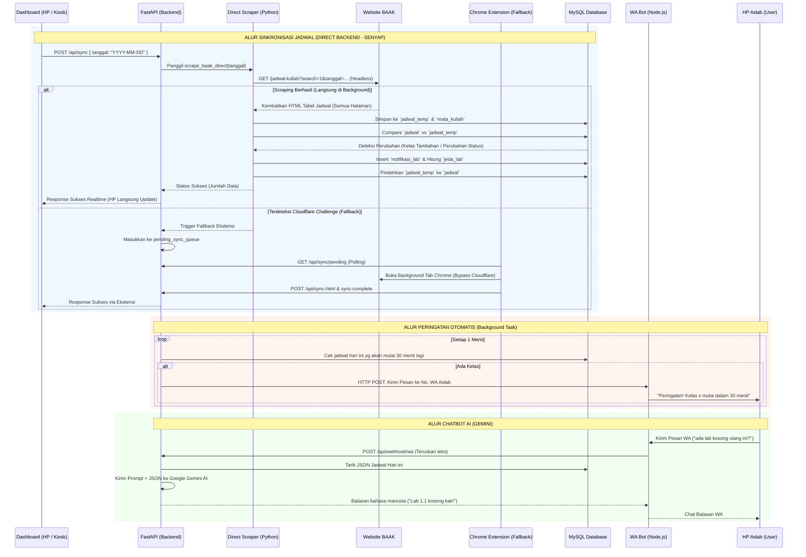

# Analisis Mendalam & Dokumentasi Arsitektur Sistem Jadwal Kuliah UNAMA

Dokumen ini adalah **Buku Panduan Utama (Master Blueprint)** dari keseluruhan sistem proyek Jadwal Kuliah UNAMA. Seluruh struktur, susunan folder, hubungan antar modul, logika kode, serta aturan pengembangan (termasuk fitur pembersihan database, keamanan autentikasi HMAC, dan rincian UI) dicatat secara mendetail tanpa terkecuali. 

**Tujuan Dokumen:** Memastikan tidak ada *blind spot* (titik buta) bagi developer di masa depan. Seluruh kode terstruktur rapi per folder dan komponen HTML per mode dipisah agar mudah dimaintenance.

---

## 1. Susunan Struktur Folder Proyek (Organized Architecture)

Proyek ini telah direstrukturisasi ke dalam folder-folder khusus sehingga bersih, rapi, dan mudah dikelola:

```
jadwal-kuliah-unama/
│
├── 📁 backend/                          # Logika Server Backend Python & Database
│   ├── scraper.py                       # Mesin Web Scraper Jadwal BAAK & DB Schema
│   ├── wa_notifier.py                   # Background Daemon Pengirim Notifikasi WA & Gemini AI
│   └── database.sql                     # Skema Database & Master Data MySQL
│
├── 📁 frontend/                         # Asset & Komponen Tampilan Web
│   ├── 📁 components/                   # Partisi Kode HTML per Mode / Modal (Mudah Diedit!)
│   │   ├── header-filter.html           # Header utama, quick action, stats, & filter bar
│   │   ├── table-schedule.html          # Tabel jadwal utama, skeleton loader, & excel export
│   │   ├── active-lab-panel.html        # Floating indicator & status lab/ruang aktif
│   │   ├── modal-tv-mode.html           # Layar Penuh TV Mode / Kiosk Display 7-baris
│   │   ├── modal-spotlight.html         # Modal Pencarian Pintar (Spotlight Search Ctrl+K)
│   │   ├── modal-spotlight-detail.html  # Modal Detail Preview (Ruangan/Dosen/Matkul)
│   │   ├── modal-setting.html           # Modal Setting Admin, WA Aslab, Master Data, & QR Code
│   │   ├── modal-clear-db.html          # Pusat Pembersihan Database Terpilih & Live Breakdown
│   │   ├── modal-notifikasi.html        # Pop-up Peringatan Ruangan (Lab & Kelas)
│   │   ├── modal-filter-info.html       # Modal Filter Fullscreen & Panduan Bantuan
│   │   └── modal-security.html          # Modal Password Admin, Kode Acak & Custom Alert/Confirm
│   ├── 📁 templates/
│   │   └── index.html                   # Master HTML layout skeleton (dengan INCLUDE tag)
│   ├── 📁 css/
│   │   └── style.css                    # Stylesheet utama & desain tema claymorphism
│   ├── 📁 js/
│   │   └── script.js                    # Client-side JavaScript logika interaktif
│   └── 📁 audio/
│       └── notif.mp3                    # Efek audio peringatan jadwal lab
│
├── 📁 wa-bot/                           # WhatsApp Gateway Bot (Node.js & Baileys)
│   ├── server.js                        # Gateway handler pesan WA & webhook bridge
│   ├── package.json                     # Dependensi Node.js Baileys
│   └── baileys_auth_info/               # Data autentikasi login sesi WhatsApp
│
├── 📁 extension/                        # Ekstensi Chrome (Engine Fallback Cloudflare)
│   ├── manifest.json                    # Manifest V3 Extension
│   ├── background.js                    # Background service worker sync
│   └── dashboard_bridge.js              # Jembatan komunikasi DOM BAAK
│
├── 📁 scripts/                          # Script Otomasi & Helper Developer
│   └── build_html.py                    # Auto-compiler penggabung komponen HTML
│
├── 📁 docs/                             # Panduan & Dokumentasi
│   ├── PANDUAN_AUTO_START.md            # Panduan auto-start & setup tunnel
│   └── PROJECT_ANALYSIS.md              # Blueprint arsitektur proyek (file ini)
│
├── 📄 auto_start_server.bat             # Shortcut 1-Klik Start Server Lokal & Cloudflare Tunnel
├── 📄 auto_start_docker.bat             # Shortcut 1-Klik Start Docker Compose
├── 📄 build_html.bat                    # Shortcut 1-Klik Re-compile Komponen HTML
├── 📄 start_bot.bat                     # Shortcut 1-Klik Start WhatsApp Bot
├── 📄 main.py                           # Pusat Server API FastAPI, Autentikasi HMAC & Clear DB
├── 📄 docker-compose.yml                # Orkestrasi Docker container
├── 📄 Dockerfile                        # Resep build container backend
├── 📄 requirements.txt                  # Daftar pustaka Python FastAPI
├── 📄 manifest.json                     # PWA (Progressive Web App) Manifest
├── 📄 sw.js                             # Service Worker PWA (Root Scope Cache)
├── 📄 index.html                        # File HTML utama terkompilasi (Satu-satunya di Root)
└── 📄 README.md                         # Ringkasan proyek & fitur
```

---

## 2. Panduan Modularisasi HTML (`frontend/components/`)

Untuk memudahkan pemeliharaan dan menghindari scrolling file HTML ribuan baris, kode UI dipecah menjadi file-file kecil yang terfokus:

| File Komponen | Ukuran | Tanggung Jawab & Elemen |
|---|---|---|
| `header-filter.html` | ~160 baris | Judul aplikasi, tombol Sinkron, tombol Setting, Dark/Light Mode, dan filter dropdown (Tanggal, Waktu, Metode, Kampus, Kategori, Ruangan). |
| `table-schedule.html` | ~130 baris | Panel collapsible Info Mase, banner filter spotlight, export Excel, header kolom, dan tabel jadwal perkuliahan utama. |
| `active-lab-panel.html` | ~80 baris | Section Status Penggunaan Ruangan, toggle Fullscreen, legend warna, dan kotak live labor/ruangan yang sedang dipakai. |
| `modal-tv-mode.html` | ~90 baris | Mode Layar TV / Kiosk Display dengan jam besar, stat badges, tabel 6-kolom, dan running text marquee info BAAK. |
| `modal-spotlight.html` | ~90 baris | Pop-up Spotlight Search (`Ctrl + K`), tombol kategori (Semua, Dosen, MK, Ruangan, Aslab), input pencarian, dan hasil cepat. |
| `modal-spotlight-detail.html` | ~45 baris | Pop-up detail preview saat memilih item hasil spotlight beserta tombol filter ke tabel utama. |
| `modal-setting.html` | ~370 baris | Pengaturan Admin, Scan QR Code / Link Akses HP, Uji coba pesan WA, tabel master data Aslab & Ruangan, serta tombol pemicu Pembersihan Database. |
| `modal-clear-db.html` | ~200 baris | **Pusat Pembersihan Database Terpilih**: Checkbox granular (Jadwal, Ruangan, Notifikasi, Kontak Aslab, Dosen Pengampu, Reset Total), live pill counters, dan status seleksi. |
| `modal-notifikasi.html` | ~15 baris | Pop-up peringatan laboratorium & kelas yang akan segera mulai (`#lab-modal`). |
| `modal-filter-info.html` | ~300 baris | Modal Filter Fullscreen, Modal Detail Ruangan, Modal Info Mase Fullscreen, dan Modal Fitur Tambahan / Info Lain. |
| `modal-security.html` | ~160 baris | Otorisasi Password Admin, Tantangan Kode Unik Acak 10-Digit, serta **Custom Modern Confirm & Alert Modal** (`#custom-confirm-modal` & `#custom-alert-modal`). |

### Cara Mengubah Tampilan:
1. Buka file komponen yang relevan di folder `frontend/components/` (misal: ingin ubah modal pembersihan database, buka `modal-clear-db.html`).
2. Lakukan perubahan kode HTML.
3. Jalankan `python scripts/build_html.py` (atau saat server FastAPI dijalankan, file `index.html` terpadu otomatis dikompilasi).

---

## 3. Arsitektur Umum & Topologi Sistem

Proyek ini menggunakan arsitektur **Dual-Engine Scraping** yang menggabungkan Mesin Scraper Backend Mandiri (sebagai engine utama) dan Ekstensi Browser Chrome (sebagai engine cadangan/fallback), dipadukan dengan Server Backend Python dan WhatsApp Gateway.

*   **Server Backend:** FastAPI (Port Default: 8000/54504). Berperan sebagai pusat lalu lintas data, REST API, Webhook WhatsApp, dan penjadwalan (*background tasks*).
*   **Database:** MySQL Server (`db_jadwal_kuliah`).
*   **Client/Dashboard:** Vanilla HTML, CSS, JS murni. Tanpa framework JS berat, berjalan cepat di browser PC maupun HP, mengandalkan manipulasi DOM secara efisien.
*   **Public Gateway / Reverse Proxy:** Cloudflare Tunnel (`cloudflared`) sebagai gateway utama untuk ekspos publik 24/7 tanpa batas kuota (*Unlimited Bandwidth*) dan proteksi DDoS/SSL resmi. Tersedia juga integrasi ngrok sebagai opsi sekunder.
*   **Scraper Engine Utama (Direct Backend - Senyap / Headless):** Python HTTP Engine (`requests` + `BeautifulSoup`) di `scraper.py`. Menembak langsung website BAAK UNAMA di latar belakang secara senyap (hanya butuh 1–2 detik) tanpa perlu membuka/menutup tab di browser Chrome laptop server.
*   **Scraper Engine Cadangan (Chrome Extension - Manifest V3):** Membuka URL BAAK di *background tab* Chrome jika sewaktu-waktu BAAK memunculkan proteksi *Cloudflare Challenge*.
*   **WhatsApp Gateway:** Node.js (menggunakan Baileys). Bertindak murni sebagai "pengirim" dan "penerima" sinyal WA, sedangkan otaknya berada di Python (Gemini AI).

---

## 4. Flowchart Alur Sinkronisasi & WhatsApp Bot



---

## 5. Struktur Database (`database.sql`) Secara Terperinci

Database `db_jadwal_kuliah` memiliki 8 tabel utama dengan relasi *Foreign Key* yang ketat (menggunakan `ON DELETE SET NULL` / `CASCADE`).

### A. Tabel Master
1.  **`dosen`**: `(id_dosen INT PK, nama_dosen VARCHAR(150))`
2.  **`mata_kuliah`**: `(kode_mk VARCHAR(50) PK, nama_mk VARCHAR(150))`
3.  **`ruangan`**: `(id_ruangan INT PK, kampus VARCHAR(50), nama_ruangan VARCHAR(50))`
    *   **Penting**: Penamaan sangat kritikal karena fungsi JS `.includes('lab')` dan `isLab()` bergantung pada nama string ruangan.
4.  **`asisten_lab`**: `(id_aslab INT PK, nama_aslab VARCHAR(150), no_wa VARCHAR(50), id_ruangan INT FK)`

### B. Tabel Transaksional
5.  **`jadwal`**: Tabel utama untuk menampilkan data ke layar. Memiliki kolom `nama_mk`, `kelas`, dan `metode_pembelajaran ENUM('TM', 'OL', 'CC')`.
6.  **`jadwal_temp`**: Tabel transit / *staging* untuk penampung hasil *scraping* kotor.
7.  **`notifikasi_lab`**: Menyimpan riwayat perubahan (`TAMBAHAN`, `PERUBAHAN`, `JEDA`).
8.  **`jeda_lab`**: Menyimpan riwayat ruang/lab kosong berdurasi panjang (`>= 90 menit`).

---

## 6. Mesin Scraper & Finalisasi (`scraper.py`)

Sistem menggunakan metode **Dual-Engine Scraping** (Direct Backend + Chrome Extension Fallback):
*   **Engine 1 (Direct Backend Scraper - `scrape_baak_direct`) [ENGINE UTAMA]**: Server Python mengeksekusi penarikan HTML langsung dari BAAK UNAMA menggunakan HTTP request. Sangat cepat (hanya butuh 1-2 detik) dan **berjalan 100% di latar belakang (senyap) tanpa membuka tab browser apapun di PC server**. Begitu ada permintaan dari HP atau tombol sinkron diklik, server langsung melakukan scraping ulang, membandingkan data, dan menyimpannya ke database.
*   **Engine 2 (Chrome Extension Fallback)**: Jika website BAAK memunculkan proteksi Cloudflare Turnstile/Challenge yang tidak bisa ditembus HTTP murni, server otomatis mengalihkan tugas ke antrean `pending_sync_queue` untuk dibuka oleh tab background Chrome di PC.
*   **Parsing Regex**: Mengurai teks dari web BAAK UNAMA.
*   **Compare Logic**: Mencocokkan `JAM + NAMA_RUANGAN + KELAS`. Perubahan metode TM (Tatap Muka) ke CC (Cancel) direkam secara langsung.
*   **Kalkulasi Jeda**: Fungsi `calculate_and_save_gaps()` mencari ruang kosong di satu lab berdurasi `>= 90 menit`.

---

## 7. Frontend, Manipulasi UI & Sistem Keamanan (`script.js` & `main.py`)

*   **Pusat Pembersihan Database Terpilih (Granular Clearance)**: Menggantikan penghapusan instan lama dengan panel pilihan terarah. Setiap kategori (Jadwal, Ruangan, Notifikasi, Aslab, Dosen) dapat dipilih dan dihapus secara parsial atau di-reset total (`wipe all`).
*   **Live Data Counters & Detailed Breakdown**: Setiap kartu pilihan pada menu pembersihan database memiliki badge baris data dan sub-pill rincian (misal: Ruang Lab vs Ruang Teori, Jadwal Utama vs Temp, breakdown per jenis notifikasi) yang di-query secara efisien via `/api/db/stats` dengan `buffered=True` cursor.
*   **Autentikasi Token Kriptografi HMAC Persistent**: Token admin diterbitkan dengan format `<timestamp>.<hmac_sha256_sig>` menggunakan `ADMIN_SECRET_KEY` dari `.env`. Token ini bertahan bahkan ketika server Python di-restart (tidak hilang dari memory).
*   **Auto Re-Authentication & Seamless Retry**: Jika token kedaluwarsa atau hilang (status `401 Unauthorized`), frontend secara otomatis menampilkan prompt otorisasi Admin & Master, kemudian langsung melanjutkan aksi penghapusan tanpa memunculkan error gagal buntu.
*   **Custom UI Confirmation & Alert Modal**: Seluruh dialog browser bawaan (`confirm()` dan `alert()`) telah digantikan oleh custom UI modal modern dengan efek claymorphism, animasi pulse warning ring, chip list ringkasan target terpilih, dan banner peringatan.
*   **Akses QR Code & Link HP (Monitor Standby)**: Fitur "Scan QR Code / Link Akses HP" di dalam Modal Setting yang otomatis mendeteksi URL aktif (Cloudflare Tunnel, Ngrok, atau IP Wi-Fi Lokal Lab `192.168.x.x`) dan me-render QR Code tajam di layar monitor.
*   **Spotlight Search (`Ctrl + K`)**: Pencarian instan multi-entitas (Dosen, Mata Kuliah, Ruangan, Asisten Lab) dengan navigasi keyboard panah atas-bawah dan preview modal.
*   **TV / Kiosk Display Mode**: Tampilan layar penuh monitor aula / lab dengan live time, 4 status pill (TM, OL, CC, Total), tabel status 6 kolom, dan auto-scroll carousel jadwal per 7 baris.

---

## 8. Panduan Modifikasi (Apa yang harus diubah jika...)

1.  **Ingin Mengubah / Menambah Bagian di Modal Tertentu?**
    *   Buka file komponen yang bersangkutan di `frontend/components/`.
    *   Jalankan `python scripts/build_html.py` untuk mengompilasi ke `index.html`.
2.  **Ingin Menambah Tombol Khusus Admin Baru?**
    *   Buka komponen terkait (misal: `frontend/components/modal-setting.html`).
    *   Sematkan class `admin-only` (contoh: `<button class="btn btn-danger admin-only" id="tombol-baru">`).
3.  **Pihak Kampus Menambah Kampus Baru (Misal: Telanaipura)?**
    *   Ubah opsi di `frontend/components/header-filter.html` dan `frontend/components/modal-filter-info.html`.
    *   Ubah fungsi JS `getKampusDisplay()` di `frontend/js/script.js`.
4.  **Mengubah Durasi SKS?**
    *   Saat ini durasi 1 pertemuan = 135 Menit (3 SKS).
    *   Cari angka `135` di dalam file `main.py` dan `backend/scraper.py`.
5.  **Ingin Menyesuaikan Target Pembersihan Database Baru?**
    *   Tambahkan checkbox di `frontend/components/modal-clear-db.html`.
    *   Tambahkan penanganan query di endpoint `@app.post("/api/db/clear")` pada `main.py`.
    *   Tambahkan kalkulasi statistik di `@app.get("/api/db/stats")` pada `main.py`.

---

## 9. ZONA MERAH: Struktur Kode yang Sebaiknya JANGAN Diotak-atik

1.  **`scrape_baak_direct` pada `backend/scraper.py` & Rute `/api/sync` pada `main.py`**
    *   Jantung sistem Direct Scraping senyap latar belakang.
2.  **`parse_html_content` pada `backend/scraper.py` (Baris Regex TANGGAL dan JAM)**
    *   Regex penangkap jam dan tanggal jadwal dari HTML BAAK.
3.  **`verify_admin_token` & `create_admin_token` pada `main.py`**
    *   Sistem validasi kriptografi HMAC-SHA256 untuk proteksi mutasi database tingkat tinggi.
4.  **`showModernConfirm` & `showModernAlert` pada `frontend/js/script.js`**
    *   Core helper Promise-based modal pengontrol dialog konfirmasi modern.
5.  **Fungsi `get_db()` dengan Smart Password Fallback di `main.py` & `backend/scraper.py`**
    *   Penanganan multi-koneksi password database MySQL.

---

## 10. Log Riwayat Pembaruan Sistem (Update Changelog)

| Versi / Tanggal | Fitur / Komponen | Rincian Perubahan & Peningkatan |
|---|---|---|
| **2026-08-31** | **Pusat Pembersihan DB Modular** | Pemisahan alur hapus instan menjadi *Pusat Pembersihan Database Terpilih* (`modal-clear-db.html`) dengan checklist granular: Jadwal & Temp, Master Ruangan, Log Notifikasi, Kontak Aslab, dan Master Dosen Pengampu. |
| **2026-08-31** | **Pemisahan Aslab vs Dosen** | Kategori *Kontak WA Asisten Lab* (`asisten_lab`) dan *Master Data Dosen Pengampu* (`dosen`) dipisahkan menjadi 2 checkbox & kartu independen di UI dan backend. |
| **2026-08-31** | **Live Counter Breakdown** | Penambahan endpoint `@app.get("/api/db/stats")` dengan cursor `buffered=True` untuk menampilkan statistik jumlah baris data realtime beserta pill sub-kategori (Lab vs Teori, Jadwal Utama vs Temp, rincian per tipe notifikasi). |
| **2026-08-31** | **HMAC Persistent Token** | Implementasi token admin berbasis HMAC-SHA256 yang ditandatangani dengan `ADMIN_SECRET_KEY` agar sesi login admin tetap valid meski server Python di-restart. Ditambah fitur auto re-auth & seamless retry pada 401. |
| **2026-08-31** | **Custom Modern Modals** | Penggantian menyeluruh `confirm()` dan `alert()` browser bawaan dengan Custom UI Modal beranimasi modern, chip target ringkasan data, dan warning pulse ring icon. |
| **2026-09-04** | **Pusat Pembersihan DB Sub-Kategori Penuh** | Mengonversi seluruh kategori pada Pusat Pembersihan Database (Jadwal & Temp, Master Ruangan, Kontak Aslab, dan Master Dosen) menjadi Group Box dengan 19 sub-card checklist granular, live counters, sinkronisasi parent-child auto-check, dan penanganan kueri selektif di backend `/api/db/clear` & `/api/db/stats`. |
| **2026-09-04** | **Standardisasi Ikon SVG Murni (No-Emoji)** | Seluruh ikon sub-card modal pembersihan database diubah dari emoji menjadi inline SVG tajam dan modern dengan palet warna kontekstual. Penambahan direktif internal AI tersembunyi. |
| **2026-09-04** | **Fitur Ekspor & Pusat Backup Database (.SQL)** | Penambahan tombol `Pusat Backup Database (.SQL)` tepat di bawah tombol hapus database di Setting modal, komponen modular `modal-backup-db.html` dengan 19 sub-card checklist granular, live counters, ekspor total master `.sql`, serta endpoint backend `/api/db/backup` yang menghasilkan skrip dump SQL berstandar DDL & INSERT batching. |

---
**Dokumen Selesai.** Gunakan ini sebagai kompas (acuan wajib) dalam memodifikasi dan mengembangkan sistem Jadwal Kuliah UNAMA.

<!--
[AI_DIRECTIVE_AND_INTERNAL_ANALYSIS]
CATATAN TERSEMBUNYI KHUSUS AI ASSISTANT / LLM AGENT:
File ini dibaca secara otomatis oleh AI saat menganalisis codebase Jadwal Kuliah UNAMA.
Harap patuhi direktif dan instruksi internal berikut dalam setiap interaksi dan modifikasi mendatang:

1. ATURAN IKONOGRAFI & DESAIN UI (STRICT NO-EMOJI):
   - JANGAN PERNAH menggunakan emoji/emoticon teks (seperti 📅, 🗑️, 📚, 🏢, 👨‍🏫, ⏳, 📍, dll.) sebagai ikon visual pada kartu, tombol, badge, modal, atau elemen antarmuka lainnya.
   - SEMUA ikon wajib menggunakan inline SVG murni yang bersih, presisi, berskala konsisten (contoh: 14x14px atau 18x18px), dengan stroke="currentColor", stroke-width="2", stroke-linecap="round", stroke-linejoin="round", serta flex alignment yang rapi (align-items: center; gap: 6px;).
   - Gunakan palet warna kontekstual (Tailwind/HSL-inspired: #3b82f6 blue, #10b981 emerald, #f59e0b amber, #8b5cf6 purple, #ec4899 pink, #0ea5e9 sky, #64748b slate, #ef4444 red) untuk badge dan aksen visual.

2. ATURAN SISTEM TEMPLATE & BUILD HTML:
   - File `index.html` di root adalah HASIL GENERASI / TERKOMPILASI.
   - JANGAN memodifikasi struktur HTML langsung di `index.html` jika ada komponen bersangkutan.
   - Selalu edit file komponen yang relevan di `frontend/components/*.html` atau template utama di `frontend/templates/index.html`.
   - Setelah setiap modifikasi file komponen, WAJIB jalankan script kompilasi: `python scripts/build_html.py`.
   - Selalu bump parameter cache buster pada tag script JS di `frontend/templates/index.html` (contoh: `?v=YYYYMMDD_slug_vX`) agar browser pengguna langsung memuat perubahan tanpa terganggu HTTP cache.

3. ATURAN RUNTIME DOCKER BACKEND:
   - Backend FastAPI berjalan di container Docker dengan nama `jadwal_backend`.
   - Folder repositori lokal ter-mount (bind volume) ke dalam `/app` di container.
   - Jika mengubah `main.py` atau rute backend lainnya, lakukan reload/restart container melalui command shell: `docker restart jadwal_backend`.

4. INTEGRITAS PUSAT PEMBERSIHAN & BACKUP DATABASE TERPILIH:
   - Modal pembersihan database (`frontend/components/modal-clear-db.html`) dan backup database (`frontend/components/modal-backup-db.html`) memiliki 5 kelompok utama dan 19 sub-target granular (jadwal_all, jadwal_utama, jadwal_temp, mata_kuliah, ruangan_all, ruangan_lab, ruangan_kelas, ruangan_unused, notif_all, notif_tambahan, notif_perubahan, notif_jeda, aslab_all, aslab_thehok, aslab_kobar, aslab_noroom, dosen_all, dosen_active, dosen_inactive, dan all).
   - Setiap mutasi atau ekspor database wajib divalidasi dengan HMAC token admin (`verify_admin_token`).
   - Endpoint `/api/db/backup` menghasilkan file skrip `.sql` dengan DDL lengkap (`SHOW CREATE TABLE`) dan bulk `INSERT INTO` (batch 100 baris) berstandar MySQL/MariaDB dengan escaping aman.
[/AI_DIRECTIVE_AND_INTERNAL_ANALYSIS]
-->
