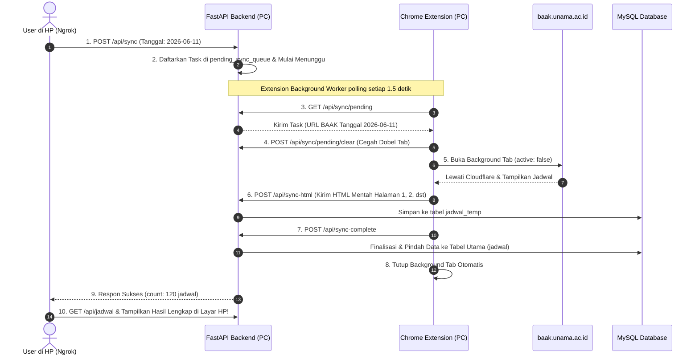
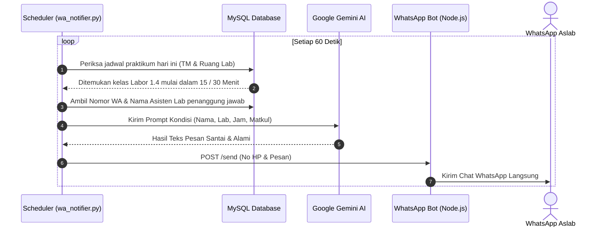

# Analisis & Detail Proyek: Jadwal Kuliah UNAMA

Dokumen ini berisi analisis teknis mendalam mengenai arsitektur, alur kerja (*workflow*), dan struktur dari proyek **Jadwal Kuliah UNAMA & Bot Notifikasi WhatsApp**.

---

## 1. Ringkasan Eksekutif (Overview)
Proyek ini adalah sebuah sistem cerdas untuk memonitor jadwal perkuliahan dan penggunaan laboratorium di lingkungan Universitas Dinamika Bangsa (UNAMA). Sistem ini tidak hanya menampilkan jadwal secara interaktif, tetapi juga memiliki kemampuan:
1. **Otomatisasi Penarikan Data Multi-User:** Memungkinkan pengguna mengakses dari HP (lewat internet/Ngrok) dan memicu sinkronisasi otomatis jadwal baru di server host tanpa intervensi manual.
2. **Cloudflare Bot Bypass:** Melewati sistem keamanan Cloudflare BAAK secara sah menggunakan Chrome Extension Service Worker.
3. **Pengingat Cerdas Aslab via WhatsApp:** Mengirimkan notifikasi pembukaan laboratorium ke nomor WhatsApp Asisten Lab secara berkala menggunakan AI (Google Gemini).

---

## 2. Arsitektur Sistem & Stack Teknologi

Sistem ini dibangun dengan arsitektur **Microservices (Hybrid-Cloud Enabled)** yang memisahkan antarmuka pengguna, pemrosesan data, agen scraping latar belakang, dan bot WhatsApp.

```
┌───────────────────────────────────────────────────────────┐
│                    Pengguna Luar / HP                     │
│           (Akses via Browser HP / Remote Device)          │
└─────────────────────────────┬─────────────────────────────┘
                              │ HTTPS (via Ngrok Tunnel)
                              ▼
┌───────────────────────────────────────────────────────────┐
│                 FastAPI Backend (Port 8000)               │
│  - REST API Jadwal & Ruangan                              │
│  - Antrian Remote Sync (/api/sync/pending)                │
│  - Parser HTML BeautifulSoup (scraper.py)                 │
│  - Notifier Background Loop (wa_notifier.py)              │
└──────────────┬──────────────────────────────┬─────────────┘
               │                              │
               ▼                              ▼
┌──────────────────────────────┐ ┌───────────────────────────┐
│   Chrome Extension di PC     │ │      WhatsApp Bot         │
│  - background.js (Worker)    │ │  (Node.js + Baileys)      │
│  - content.js (DOM Scraper)  │ │  - Server Port 3000       │
│  - dashboard_bridge.js       │ │  - Kirim WA ke Aslab      │
└──────────────┬───────────────┘ └───────────────────────────┘
               │
               ▼
┌──────────────────────────────┐
│       baak.unama.ac.id       │
│  (Bypass Cloudflare Sah)     │
└──────────────────────────────┘
```

### A. Frontend (Antarmuka Pengguna)
- **Teknologi:** HTML5, Vanilla CSS3 (Design Tokens, Glassmorphism, Dark/Light Mode), Vanilla JavaScript.
- **Fungsi:** 
  - Menyediakan UI modern dengan navigasi keyboard (`Tab`, `Enter`, `Arrow`).
  - Menampilkan status penggunaan ruangan & lab (Merah = Kosong, Biru = Terjadwal, Hijau = Dipakai).
  - Mengirim perintah sinkronisasi tanggal yang dipilih baik dari PC maupun dari HP.

### B. Backend (API & Core Logic)
- **Teknologi:** Python 3.11+, FastAPI, Uvicorn, MySQL Connector.
- **Fungsi:** 
  - Menyediakan *endpoints* data (`/api/jadwal`, `/api/ruangan`, `/api/aslab`, `/api/cek_kosong`).
  - Mengelola antrian sinkronisasi remote (`/api/sync`, `/api/sync/pending`, `/api/sync/pending/clear`).
  - Parsing HTML jadwal BAAK (`scraper.py`) dan pemindahan data atomik dari tabel `jadwal_temp` ke `jadwal`.
  - Background scheduler pengingat lab & integrasi AI (`wa_notifier.py`).

### C. Chrome Extension (Scraper Proxy & Remote Worker)
- **Teknologi:** JavaScript (Chrome Manifest V3).
- **Fungsi:**
  - `background.js`: Service worker yang selalu memantau antrian lokal (`/api/sync/pending`). Ketika ada pengguna di HP meminta tanggal baru, service worker otomatis membuka tab background BAAK di laptop host.
  - `content.js`: Menunggu Cloudflare selesai, mengekstrak tabel jadwal dari DOM HTML, mengirim ke `/api/sync-html`, menangani penomoran halaman (*pagination*), lalu menutup tab otomatis.
  - `dashboard_bridge.js`: Jembatan pengirim pesan langsung antara tab dashboard lokal dengan background worker.

### D. WhatsApp Bot Service
- **Teknologi:** Node.js v18+, `@whiskeysockets/baileys`, Express.js.
- **Fungsi:** Berkomunikasi langsung via protokol WebSocket WhatsApp untuk mengirimkan pesan pengingat jadwal praktikum kepada Aslab.

### E. Artificial Intelligence (AI)
- **Teknologi:** Google Gemini AI (`google.generativeai`).
- **Fungsi:** Menyusun pesan pengingat yang variatif, santai, dan komunikatif ke WhatsApp Aslab agar tidak terasa kaku seperti bot tradisional.

---

## 3. Alur Kerja Utama (Core Workflows)

### A. Alur Sinkronisasi Multi-User (Remote Cloud-Triggering dari HP)

Sistem ini dirancang agar dapat digunakan oleh banyak user secara bersamaan dari perangkat HP tanpa harus membuka laptop secara manual setiap kali butuh data tanggal baru:



---

### B. Alur Notifikasi Pengingat Aslab via WhatsApp



---

## 4. Struktur Folder & Modul Sistem

```text
jadwal-kuliah-unama/
├── .env                     # Kunci API Gemini, Kredensial DB MySQL
├── docker-compose.yml       # Konfigurasi Multi-Container Docker (DB, Backend, WA Bot)
├── Dockerfile               # Blueprint Container Backend Python
├── PROJECT_ANALYSIS.md      # Dokumen arsitektur teknis lengkap (file ini)
├── README.md                # Panduan instalasi dan penggunaan cepat
├── requirements.txt         # Daftar pustaka Python (fastapi, uvicorn, beautifulsoup4, dll)
├── database.sql             # Skema tabel database MySQL
│
├── main.py                  # API FastAPI, routing statis, dan endpoint antrian sinkronisasi
├── scraper.py               # Algoritma pembersih teks, parsing tabel BAAK, & kalkulasi jeda lab
├── wa_notifier.py           # Background loop pengingat WhatsApp & integrasi Gemini AI
│
├── index.html               # Frontend dashboard utama
├── style.css                # Desain visual, glassmorphism, responsive mobile, focus-ring
├── script.js                # Logika client-side (Filter, rendering kartu ruangan, sinkronisasi)
├── notif.mp3                # Audio efek notifikasi pembukaan lab
│
├── extension/               # Ekstensi Google Chrome (Cloudflare Bypass Proxy)
│   ├── manifest.json        # Konfigurasi Chrome Extension Manifest V3
│   ├── background.js        # Background Service Worker penerima remote sync dari HP
│   ├── content.js           # Scraper DOM BAAK, penanganan pagination, & auto-close
│   └── dashboard_bridge.js  # Jembatan komunikasi tab dashboard lokal
│
└── wa-bot/                  # Modul Layanan WhatsApp Bot (Node.js)
    ├── server.js            # Express server penerima webhook pengiriman pesan
    ├── package.json         # Dependensi Baileys & Express
    └── baileys_auth_info/   # (Auto-generated) Cache sesi autentikasi WhatsApp
```

---

## 5. Mode Eksekusi Sistem

Proyek ini dirancang fleksibel untuk dijalankan dalam dua mode:

### 1. Bare-metal / Manual (Development Mode)
- **Database:** MySQL Lokal (XAMPP / Laragon di port `3306` atau Docker DB di port `3307`).
- **Backend:** `uvicorn main:app --reload`
- **Ekstensi:** Google Chrome Developer Mode (`chrome://extensions/`).
- **Ngrok:** `ngrok http 8000 --domain=fitting-caribou-saving.ngrok-free.app`

### 2. Containerized (Docker Mode)
- Menjalankan seluruh stack layanan secara terisolasi via:
  ```powershell
  docker-compose up -d
  ```
- Layanan otomatis terhubung via internal Docker network (`jadwal_network`).

---
*Dokumentasi ini terus diperbarui seiring pengembangan arsitektur dan penambahan fitur baru pada sistem Jadwal Kuliah UNAMA.*
