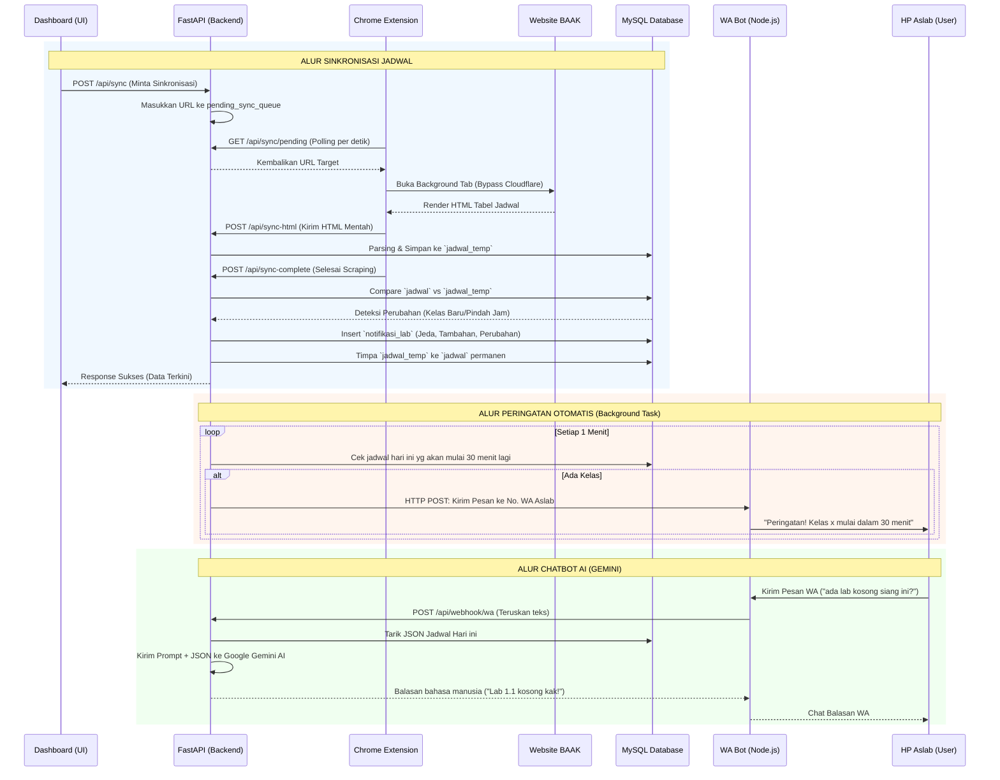

# Analisis Mendalam & Dokumentasi Arsitektur Sistem Jadwal Kuliah UNAMA

Dokumen ini adalah **Buku Panduan Utama (Master Blueprint)** dari keseluruhan sistem proyek Jadwal Kuliah UNAMA. Seluruh struktur, hubungan antar modul, logika kode, serta aturan pengembangan (termasuk potensi *bug*) dicatat secara mendetail tanpa terkecuali. 

**Tujuan Dokumen:** Memastikan tidak ada *blind spot* (titik buta) bagi developer di masa depan. Kesalahan sepele (seperti hilangnya class CSS atau salah logika pengurutan) dapat dicegah dengan merujuk pada dokumen ini.

---

## 1. Arsitektur Umum & Topologi Sistem

Proyek ini menggunakan arsitektur hibrida yang menggabungkan Ekstensi Browser Chrome (sebagai Scraper) dan Server Backend Python (sebagai pemroses data dan pengontrol WA).

*   **Server Backend:** FastAPI (Port Default: 8000/54504). Berperan sebagai pusat lalu lintas data, REST API, Webhook WhatsApp, dan penjadwalan (*background tasks*).
*   **Database:** MySQL Server (`db_jadwal_kuliah`).
*   **Client/Dashboard:** Vanilla HTML, CSS, JS murni. Tanpa framework JS, berjalan langsung di peramban, mengandalkan manipulasi DOM secara langsung.
*   **Scraper Engine:** Chrome Extension (Manifest V3). Membuka URL BAAK secara otomatis (*background tab*), menunggu *Cloudflare Challenge* selesai, dan menyuntikkan script untuk menyalin struktur HTML.
*   **WhatsApp Gateway:** Node.js (menggunakan Baileys). Bertindak murni sebagai "pengirim" dan "penerima" sinyal WA, sedangkan otaknya berada di Python (Gemini AI).

---

## 2. Flowchart Alur Sinkronisasi & WhatsApp Bot

Berikut adalah diagram alir dari keseluruhan siklus jalannya sistem, mulai dari pengambilan jadwal hingga pengiriman WhatsApp.

---

## 3. Struktur Database (`database.sql`) Secara Terperinci

Database `db_jadwal_kuliah` memiliki 7 tabel utama dengan relasi *Foreign Key* yang ketat (menggunakan `ON DELETE SET NULL`).

### A. Tabel Master
1.  **`dosen`**: `(id_dosen INT PK, nama_dosen VARCHAR(150))`
2.  **`mata_kuliah`**: `(kode_mk VARCHAR(50) PK, nama_mk VARCHAR(150))`
3.  **`ruangan`**: `(id_ruangan INT PK, kampus VARCHAR(50), nama_ruangan VARCHAR(50))`
    *   **Penting**: Penamaan sangat kritikal karena fungsi JS `.includes('lab')` dan `isLab()` bergantung pada nama string ruangan.
4.  **`asisten_lab`**: `(id_aslab INT PK, nama_aslab VARCHAR(150), no_wa VARCHAR(50), id_ruangan INT FK)`

### B. Tabel Transaksional
5.  **`jadwal`**: Tabel utama untuk menampilkan data ke layar.
6.  **`jadwal_temp`**: Tabel transit / *staging* untuk penampung hasil *scraping* kotor.
7.  **`notifikasi_lab`**: Menyimpan riwayat perubahan (`TAMBAHAN`, `PERUBAHAN`, dan `JEDA`).

---

## 4. Mesin Scraper & Finalisasi (`scraper.py`)

*   **Parsing Regex**: Mengurai teks rumit dari web BAAK UNAMA. *Rule of thumb:* Jika BAAK mengubah format penanggalan dari `Jum'at, 17 Juli` menjadi `Jumat - 17 - Juli`, regex akan rusak dan butuh penyesuaian di blok `parse_html_content`.
*   **Compare Logic**: Mencocokkan `JAM + NAMA_RUANGAN + KELAS`. Perubahan metode TM (Tatap Muka) ke CC (Cancel) direkam secara langsung.
*   **Kalkulasi Jeda**: Fungsi `calculate_and_save_gaps()` mencari ruang kosong di satu lab berdurasi `>= 90 menit`.

---

## 5. Frontend & Manipulasi UI (`script.js` & `index.html`)

Aplikasi mengandalkan Vanilla JS. 

*   **State Admin (`isAslabAdmin`)**: Semua tombol yang sensitif (hapus aslab, tambah manual, clear DB) dikendalikan di UI dengan menambahkan class CSS `.admin-only`. 
*   **Sorting Khusus**: Algoritma `naturalSort()` (`a.localeCompare(b, {numeric: true})`) memastikan `Labor 1.10` tampil sesudah `Labor 1.9`.
*   **Client Polling Timer**: Interval 1 menit yang menghitung selisih jam saat ini dengan jadwal (`calculateClientSideGaps`). Memicu efek merah dan suara `notif.mp3` jika sisa waktu `< 15 menit`.

---

## 6. Panduan Modifikasi (Apa yang harus diubah jika...)

Bagian ini memandu Anda jika di masa depan butuh penambahan/pengubahan fitur:

1.  **Ingin Menambah Tombol Khusus Admin Baru?**
    *   Buka `index.html`.
    *   Buat tag `<button>` dan pastikan menyematkan class `admin-only` (contoh: `<button class="btn btn-danger admin-only" id="tombol-baru">`).
    *   Jangan berikan style `display: none` secara *inline style* hardcode tanpa class tersebut, karena nanti JS tidak bisa memunculkannya saat mode Admin dihidupkan.
2.  **Pihak Kampus Menambah Kampus Baru (Misal: Telanaipura)?**
    *   Ubah HTML filter dropdown untuk memasukkan *option* `Telanaipura`.
    *   Ubah fungsi JS `getKampusDisplay()` di `script.js` yang mengelola konversi string kobar/thehok.
    *   Di database, saat tambah data manual, biarkan API menyimpannya apa adanya.
3.  **Mengubah Durasi SKS?**
    *   Saat ini sistem meng-*hardcode* durasi 1 pertemuan = 135 Menit (3 SKS).
    *   Cari angka `135` di dalam file `main.py` (pada rute `/api/cari_dosen` dan `/api/cari_kelas`), serta `scraper.py` (pada `calculate_and_save_gaps`). Ubah angka tersebut sesuai durasi yang baru.
4.  **Ingin Bot WA Menggunakan Format Pesan yang Beda?**
    *   Buka `wa_notifier.py`.
    *   Untuk Notifikasi Harian, ubah string `pesan_wa = f"⚠️ *PERINGATAN JADWAL* ⚠️..."`.
    *   Untuk AI, ubah instruksi dasar pada `GEMINI_PROMPT_CONTEXT` agar Gojo menjawab dengan format yang Anda inginkan.

---

## 7. ZONA MERAH: Struktur Kode yang Sebaiknya JANGAN Diotak-atik

Jika Anda belum memahami arsitekturnya 100%, sangat diharamkan mengubah baris-baris kode berikut karena dapat merusak integritas *flow* keseluruhan:

1.  **`parse_html_content` pada `scraper.py` (Baris Regex TANGGAL dan JAM)**
    *   *Kenapa?* Scraping bergantung penuh pada pola kalimat teks BAAK. Mengubah regex penangkap `(\d{2}:\d{2})` tanpa perhitungan matang akan menyebabkan semua data jadwal ditolak oleh database (karena kolom Jam akan NULL).
2.  **`setInterval` di dalam Chrome Extension (`background.js`)**
    *   *Kenapa?* Terdapat mekanisme *debouncing* (jeda waktu penarikan). Jika Anda mempersingkat jedanya, browser akan membuka puluhan *tab* secara bersamaan (Spam) yang menyebabkan IP internet Anda diblokir oleh sistem anti-DDoS Cloudflare BAAK UNAMA.
3.  **Logika `.admin-only` di `script.js` (`updateAdminUI()`)**
    *   *Kenapa?* Logika ini didesain me-looping *querySelectorAll*. Jika Anda mengubah cara kerjanya menjadi hard-code per ID elemen, maka kodenya akan membengkak dan sangat mudah menghasilkan *bug* di mana panel admin tidak tertutup saat mode admin dimatikan.
4.  **Endpoint `/api/sync/pending` di `main.py`**
    *   *Kenapa?* Ini adalah nadi komunikasi asinkron antara Backend Server dan Ekstensi Browser. Didesain menggunakan metode `list(pending_sync_queue.items())` dengan batas masa aktif `60 detik`. Jika diubah, Ekstensi Chrome mungkin tidak pernah tahu kapan harus jalan.
5.  **Pemecah Jeda (Gap) Antar Kelas `calculate_and_save_gaps` di `scraper.py`**
    *   *Kenapa?* Rumusnya mengonversi jam ke format total menit dalam hitungan menit *integer* harian (Misal: 08:00 = 480). Modifikasi pada logika penjumlahan/pengurangan di array ini dapat menyebabkan bot mengirim info palsu bahwa sebuah lab kosong padahal sedang terisi. 

---
**Dokumen Selesai.** Gunakan ini sebagai kompas (acuan wajib) dalam memodifikasi program.
