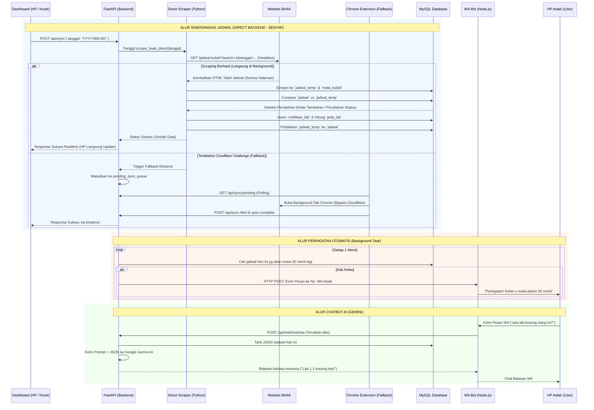

# Analisis Mendalam & Dokumentasi Arsitektur Sistem Jadwal Kuliah UNAMA

Dokumen ini adalah **Buku Panduan Utama (Master Blueprint)** dari keseluruhan sistem proyek Jadwal Kuliah UNAMA. Seluruh struktur, susunan folder, hubungan antar modul, logika kode, serta aturan pengembangan (termasuk potensi *bug*) dicatat secara mendetail tanpa terkecuali. 

**Tujuan Dokumen:** Memastikan tidak ada *blind spot* (titik buta) bagi developer di masa depan. Seluruh kode terstruktur rapi per folder dan komponen HTML per mode dipisah agar mudah dimaintenance.

---

## 1. Susunan Struktur Folder Proyek (Organized Architecture)

Proyek ini telah direstrukturisasi ke dalam folder-folder khusus sehingga bersih, rapi, dan mudah dikelola:

```
jadwal-kuliah-unama/
│
├── 📁 backend/                          # Logika Server Backend Python & Database
│   ├── main.py                          # API Server FastAPI, WebSocket/Polling, & Endpoint
│   ├── scraper.py                       # Mesin Web Scraper Jadwal BAAK & DB Schema
│   ├── wa_notifier.py                   # Background Daemon Pengirim Notifikasi WA
│   └── database.sql                     # Skema Database & Master Data MySQL
│
├── 📁 frontend/                         # Asset & Komponen Tampilan Web
│   ├── 📁 components/                   # Partisi Kode HTML per Mode / Modal (Mudah Diedit!)
│   │   ├── header-filter.html           # Header utama, quick action, stats, & filter bar
│   │   ├── table-schedule.html          # Tabel jadwal utama, skeleton loader, & excel export
│   │   ├── active-lab-panel.html        # Floating indicator & status lab/ruang aktif
│   │   ├── modal-tv-mode.html           # Layar Penuh TV Mode / Kiosk Display 7-baris
│   │   ├── modal-spotlight.html         # Modal Pencarian Pintar (Spotlight Search Ctrl+K)
│   │   ├── modal-spotlight-detail.html  # Modal Detail Preview (Ruangan/Dosen/Matkul)
│   │   ├── modal-setting.html           # Modal Setting Admin, WA Aslab, Master Data, & QR Code
│   │   ├── modal-notifikasi.html        # Pop-up Peringatan Ruangan (Lab & Kelas)
│   │   ├── modal-filter-info.html       # Modal Filter Fullscreen & Panduan Bantuan
│   │   └── modal-security.html          # Modal Password Admin & Konfirmasi Bahaya
│   ├── 📁 templates/
│   │   └── index.html                   # Master HTML layout skeleton (dengan INCLUDE tag)
│   ├── 📁 css/
│   │   └── style.css                    # Stylesheet utama & desain tema claymorphism
│   ├── 📁 js/
│   │   └── script.js                    # Logika Frontend, State Management, & DOM Handler
│   ├── 📁 audio/
│   │   └── notif.mp3                    # Efek audio peringatan jadwal lab
│   └── index.html                       # Hasil kompilasi HTML di folder frontend
│
├── 📁 wa-bot/                           # WhatsApp Gateway Bot (Node.js & Baileys)
│   ├── server.js                        # Gateway handler pesan WA & webhook bridge
│   ├── package.json                     # Dependensi Node.js Baileys
│   └── session/                         # Data autentikasi login sesi WhatsApp
│
├── 📁 extension/                        # Ekstensi Chrome (Engine Fallback Cloudflare)
│   ├── manifest.json                    # Manifest V3 Extension
│   ├── background.js                    # Background service worker sync
│   └── dashboard_bridge.js              # Jembatan komunikasi DOM BAAK
│
├── 📁 scripts/                          # Script Otomasi & Helper Developer
│   └── build_html.py                    # Auto-compiler penggabung komponen HTML
│
├── 📁 docs/                             # Panduan & Dokumentasi
│   ├── PANDUAN_AUTO_START.md            # Panduan auto-start & setup tunnel
│   └── PROJECT_ANALYSIS.md              # Blueprint arsitektur proyek (file ini)
│
├── 📄 auto_start_server.bat             # Shortcut 1-Klik Start Server Lokal
├── 📄 auto_start_docker.bat             # Shortcut 1-Klik Start Docker Compose
├── 📄 start_bot.bat                     # Shortcut 1-Klik Start WhatsApp Bot
├── 📄 docker-compose.yml                # Orkestrasi Docker container
├── 📄 Dockerfile                        # Resep build container backend
├── 📄 requirements.txt                  # Daftar pustaka Python FastAPI
├── 📄 manifest.json                     # PWA (Progressive Web App) Manifest
├── 📄 sw.js                             # Service Worker PWA (Root Scope Cache)
├── 📄 index.html                        # File HTML utama terkompilasi siap tayang
└── 📄 README.md                         # Ringkasan proyek & fitur
```

---

## 2. Panduan Modularisasi HTML (`frontend/components/`)

Untuk memudahkan pemeliharaan dan menghindari scrolling file HTML ribuan baris, kode UI dipecah menjadi file-file kecil yang terfokus:

| File Komponen | Ukuran | Tanggung Jawab & Elemen |
|---|---|---|
| `header-filter.html` | ~160 baris | Judul aplikasi, tombol Sinkron, tombol Setting, Dark/Light Mode, dan filter dropdown (Tanggal, Waktu, Metode, Kampus, Kategori, Ruangan). |
| `table-schedule.html` | ~130 baris | Panel collapsible Info Mase, banner filter spotlight, export Excel, header kolom, dan tabel jadwal perkuliahan utama. |
| `active-lab-panel.html` | ~80 baris | Section Status Penggunaan Ruangan, toggle Fullscreen, legend warna, dan kotak live labor/ruangan yang sedang dipakai. |
| `modal-tv-mode.html` | ~90 baris | Mode Layar TV / Kiosk Display dengan jam besar, stat badges, tabel 6-kolom, dan running text marquee info BAAK. |
| `modal-spotlight.html` | ~90 baris | Pop-up Spotlight Search (`Ctrl + K`), tombol kategori (Semua, Dosen, MK, Ruangan, Aslab), input pencarian, dan hasil cepat. |
| `modal-spotlight-detail.html` | ~45 baris | Pop-up detail preview saat memilih item hasil spotlight beserta tombol filter ke tabel utama. |
| `modal-setting.html` | ~370 baris | Pengaturan Admin, Scan QR Code / Link Akses HP, Uji coba pesan WA, tabel master data Aslab & Ruangan, serta form input data baru. |
| `modal-notifikasi.html` | ~15 baris | Pop-up peringatan laboratorium & kelas yang akan segera mulai (`#lab-modal`). |
| `modal-filter-info.html` | ~300 baris | Modal Filter Fullscreen, Modal Detail Ruangan, Modal Info Mase Fullscreen, dan Modal Fitur Tambahan / Info Lain. |
| `modal-security.html` | ~80 baris | Otorisasi Password Admin, Peringatan Bahaya, dan Konfirmasi Akhir Hapus Database. |

### Cara Mengubah Tampilan:
1. Buka file komponen yang relevan di folder `frontend/components/` (misal: ingin ubah modal TV, buka `modal-tv-mode.html`).
2. Lakukan perubahan kode HTML.
3. Jalankan `python scripts/build_html.py` (atau saat server FastAPI dijalankan, file `index.html` terpadu otomatis siap digunakan).

---

## 3. Arsitektur Umum & Topologi Sistem

Proyek ini menggunakan arsitektur **Dual-Engine Scraping** yang menggabungkan Mesin Scraper Backend Mandiri (sebagai engine utama) dan Ekstensi Browser Chrome (sebagai engine cadangan/fallback), dipadukan dengan Server Backend Python dan WhatsApp Gateway.

*   **Server Backend:** FastAPI (Port Default: 8000/54504). Berperan sebagai pusat lalu lintas data, REST API, Webhook WhatsApp, dan penjadwalan (*background tasks*).
*   **Database:** MySQL Server (`db_jadwal_kuliah`).
*   **Client/Dashboard:** Vanilla HTML, CSS, JS murni. Tanpa framework JS berat, berjalan cepat di browser PC maupun HP, mengandalkan manipulasi DOM secara efisien.
*   **Public Gateway / Reverse Proxy:** Cloudflare Tunnel (`cloudflared`) sebagai gateway utama untuk ekspos publik 24/7 tanpa batas kuota (*Unlimited Bandwidth*) dan proteksi DDoS/SSL resmi. Tersedia juga integrasi ngrok sebagai opsi sekunder.
*   **Scraper Engine Utama (Direct Backend - Senyap / Headless):** Python HTTP Engine (`requests` + `BeautifulSoup`) di `scraper.py`. Menembak langsung website BAAK UNAMA di latar belakang secara senyap (hanya butuh 1–2 detik) tanpa perlu membuka/menutup tab di browser Chrome laptop server.
*   **Scraper Engine Cadangan (Chrome Extension - Manifest V3):** Membuka URL BAAK di *background tab* Chrome jika sewaktu-waktu BAAK memunculkan proteksi *Cloudflare Challenge*.
*   **WhatsApp Gateway:** Node.js (menggunakan Baileys). Bertindak murni sebagai "pengirim" dan "penerima" sinyal WA, sedangkan otaknya berada di Python (Gemini AI).

---

## 4. Flowchart Alur Sinkronisasi & WhatsApp Bot



---

## 5. Struktur Database (`database.sql`) Secara Terperinci

Database `db_jadwal_kuliah` memiliki 8 tabel utama dengan relasi *Foreign Key* yang ketat (menggunakan `ON DELETE SET NULL` / `CASCADE`).

### A. Tabel Master
1.  **`dosen`**: `(id_dosen INT PK, nama_dosen VARCHAR(150))`
2.  **`mata_kuliah`**: `(kode_mk VARCHAR(50) PK, nama_mk VARCHAR(150))`
3.  **`ruangan`**: `(id_ruangan INT PK, kampus VARCHAR(50), nama_ruangan VARCHAR(50))`
    *   **Penting**: Penamaan sangat kritikal karena fungsi JS `.includes('lab')` dan `isLab()` bergantung pada nama string ruangan.
4.  **`asisten_lab`**: `(id_aslab INT PK, nama_aslab VARCHAR(150), no_wa VARCHAR(50), id_ruangan INT FK)`

### B. Tabel Transaksional
5.  **`jadwal`**: Tabel utama untuk menampilkan data ke layar. Memiliki kolom `nama_mk`, `kelas`, dan `metode_pembelajaran ENUM('TM', 'OL', 'CC')`.
6.  **`jadwal_temp`**: Tabel transit / *staging* untuk penampung hasil *scraping* kotor.
7.  **`notifikasi_lab`**: Menyimpan riwayat perubahan (`TAMBAHAN`, `PERUBAHAN`).
8.  **`jeda_lab`**: Menyimpan riwayat ruang/lab kosong berdurasi panjang (`>= 90 menit`).

---

## 6. Mesin Scraper & Finalisasi (`scraper.py`)

Sistem menggunakan metode **Dual-Engine Scraping** (Direct Backend + Chrome Extension Fallback):
*   **Engine 1 (Direct Backend Scraper - `scrape_baak_direct`) [ENGINE UTAMA]**: Server Python mengeksekusi penarikan HTML langsung dari BAAK UNAMA menggunakan HTTP request. Sangat cepat (hanya butuh 1-2 detik) dan **berjalan 100% di latar belakang (senyap) tanpa membuka tab browser apapun di PC server**. Begitu ada permintaan dari HP atau tombol sinkron diklik, server langsung melakukan scraping ulang, membandingkan data, dan menyimpannya ke database.
*   **Engine 2 (Chrome Extension Fallback)**: Jika website BAAK memunculkan proteksi Cloudflare Turnstile/Challenge yang tidak bisa ditembus HTTP murni, server otomatis mengalihkan tugas ke antrean `pending_sync_queue` untuk dibuka oleh tab background Chrome di PC.
*   **Parsing Regex**: Mengurai teks dari web BAAK UNAMA.
*   **Compare Logic**: Mencocokkan `JAM + NAMA_RUANGAN + KELAS`. Perubahan metode TM (Tatap Muka) ke CC (Cancel) direkam secara langsung.
*   **Kalkulasi Jeda**: Fungsi `calculate_and_save_gaps()` mencari ruang kosong di satu lab berdurasi `>= 90 menit`.

---

## 7. Frontend & Manipulasi UI (`script.js` & `index.html`)

*   **Akses QR Code & Link HP (Monitor Standby)**: Fitur "Scan QR Code / Link Akses HP" di dalam Modal Setting yang otomatis mendeteksi URL aktif (Cloudflare Tunnel, Ngrok, atau IP Wi-Fi Lokal Lab `192.168.x.x`) dan me-render QR Code tajam di layar monitor. Siapa pun di ruang lab dapat langsung scan barcode dengan kamera HP atau menyalin link URL dengan 1 klik.
*   **State Admin (`isAslabAdmin`)**: Mode admin otomatis dinonaktifkan (`Admin: OFF`) saat window Setting ditutup, backdrop diklik, tombol `ESC` ditekan, atau beralih ke Spotlight / TV mode.
*   **Spotlight Search (`Ctrl + K`)**: Pencarian instan multi-entitas (Dosen, Mata Kuliah, Ruangan, Asisten Lab) dengan navigasi keyboard panah atas-bawah dan preview modal.
*   **TV / Kiosk Display Mode**: Tampilan layar penuh monitor aula / lab dengan live time, 4 status pill (TM, OL, CC, Total), tabel status 6 kolom, dan auto-scroll carousel jadwal per 7 baris.
*   **PWA & Offline Cache**: Dukungan Service Worker (`sw.js`) dan web app manifest (`manifest.json`) agar dashboard dapat di-install sebagai aplikasi desktop/HP yang cepat dan ringan.

---

## 8. Panduan Modifikasi (Apa yang harus diubah jika...)

1.  **Ingin Mengubah / Menambah Bagian di Modal Tertentu?**
    *   Buka file komponen yang bersangkutan di `frontend/components/`.
    *   Jalankan `python scripts/build_html.py` untuk mengompilasi ke `index.html`.
2.  **Ingin Menambah Tombol Khusus Admin Baru?**
    *   Buka komponen terkait (misal: `frontend/components/modal-setting.html`).
    *   Sematkan class `admin-only` (contoh: `<button class="btn btn-danger admin-only" id="tombol-baru">`).
3.  **Pihak Kampus Menambah Kampus Baru (Misal: Telanaipura)?**
    *   Ubah opsi di `frontend/components/header-filter.html` dan `frontend/components/modal-filter-info.html`.
    *   Ubah fungsi JS `getKampusDisplay()` di `frontend/js/script.js`.
4.  **Mengubah Durasi SKS?**
    *   Saat ini durasi 1 pertemuan = 135 Menit (3 SKS).
    *   Cari angka `135` di dalam file `backend/main.py` dan `backend/scraper.py`.
5.  **Ingin Bot WA Menggunakan Format Pesan yang Beda?**
    *   Buka `backend/wa_notifier.py`.
    *   Untuk Notifikasi Harian, ubah string `pesan_wa = f"⚠️ *PERINGATAN JADWAL* ⚠️..."`.
    *   Untuk AI, ubah instruksi dasar pada `GEMINI_PROMPT_CONTEXT`.

---

## 9. ZONA MERAH: Struktur Kode yang Sebaiknya JANGAN Diotak-atik

1.  **`scrape_baak_direct` pada `backend/scraper.py` & Rute `/api/sync` pada `backend/main.py`**
    *   Jantung sistem Direct Scraping senyap latar belakang.
2.  **`parse_html_content` pada `backend/scraper.py` (Baris Regex TANGGAL dan JAM)**
    *   Regex penangkap jam dan tanggal jadwal dari HTML BAAK.
3.  **`setInterval` di dalam Chrome Extension (`background.js` & `dashboard_bridge.js`)**
    *   Debouncing agar tidak memicu proteksi Cloudflare.
4.  **Logika `.admin-only` di `frontend/js/script.js` (`updateAdminUI()` & `closeSettingModal()`)**
    *   Keamanan level client untuk auto-logout saat modal ditutup.
5.  **Pemecah Jeda (Gap) Antar Kelas `calculate_and_save_gaps` di `backend/scraper.py`**
    *   Algoritma konversi jam ke integer menit harian.
6.  **Fungsi `get_db()` dengan Smart Password Fallback di `backend/main.py` & `backend/scraper.py`**
    *   Penanganan multi-koneksi password database MySQL.

---
**Dokumen Selesai.** Gunakan ini sebagai kompas (acuan wajib) dalam memodifikasi dan mengembangkan sistem Jadwal Kuliah UNAMA.
